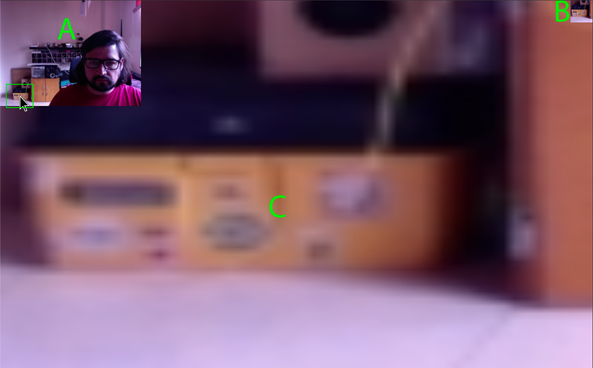

# Webcam

Vamos a hacer un primer proyecto usando la webcam y el canvas para modificar la imágen.

## Ejercicio

- Comentar los archivos de JavaScript explicando lo que hace cada bloque de código.
- Ahora la aplicación sólo esta tomando el color de 1 pixel para pintarlo en el Canvas. El ejercicio es tomar una cuadricula de 50x50 y pintarla en el canvas pero que ocupe toda la pantalla. Como un efecto de zoom.
- La posición del mouse define desde donde se toman los pixeles, debe ser el centro y no la esquina superior izquierda.

```js
No
    50px
 -----------
|x          |
|           | 50px
|           |
 -----------

Bien!

    50px
 -----------
|           |
|     x     | 50px
|           |
 -----------
```

**Resultado esperado:**

- A: stream en vivo de la webcam - 320 x 240 px.
- B: Cuadro que toma el mouse - 50 x 50px.
- C: La imagen en zoom - 100vw x 100vh (Tamaño completo de la pantalla)

```js
    100vw
 ------------------------
|   A    |           |_B_|
| _______|               |
|                        |
|                        | 100vh
|           C            |
|                        |
|                        |
 ------------------------
```


